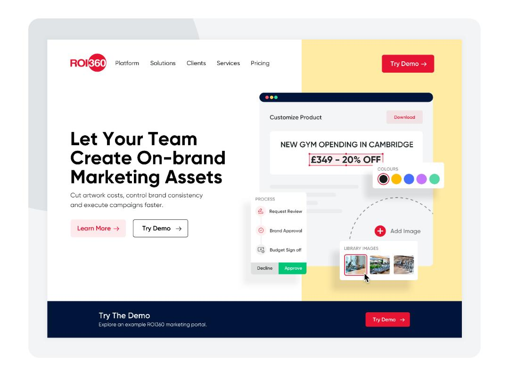
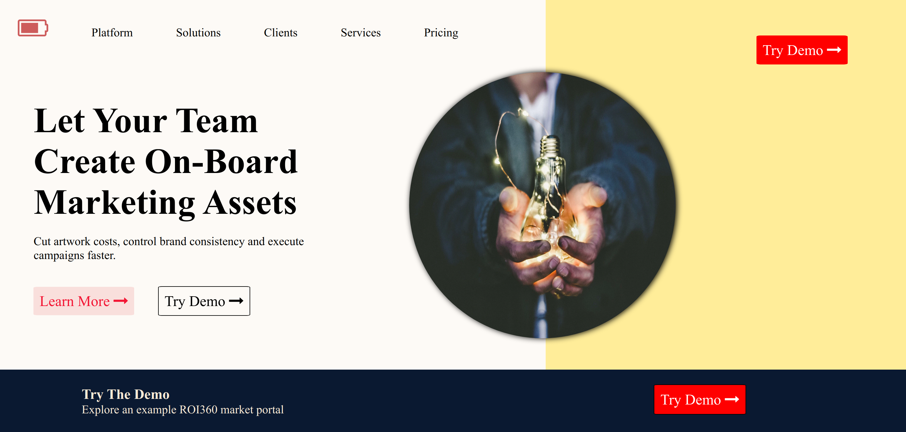

# Design to Development [EPISODE 1]

Design inspiration from dribbble , a static website made using pure HTML & CSS.
(only for desktop).

## Design from dribbble

[Design Link](https://dribbble.com/shots/15468952/attachments/7241741?mode=media)


## Web Page

[Website Link](https://designtodevelopment1.netlify.app)


## Clone Repository

Use [git](https://github.com) to clone this repository.

```bash
git clone https://github.com/rishikeshreddyakkireddy/designtodevelopment01.git
```

## Contributing

Pull requests are welcome.
